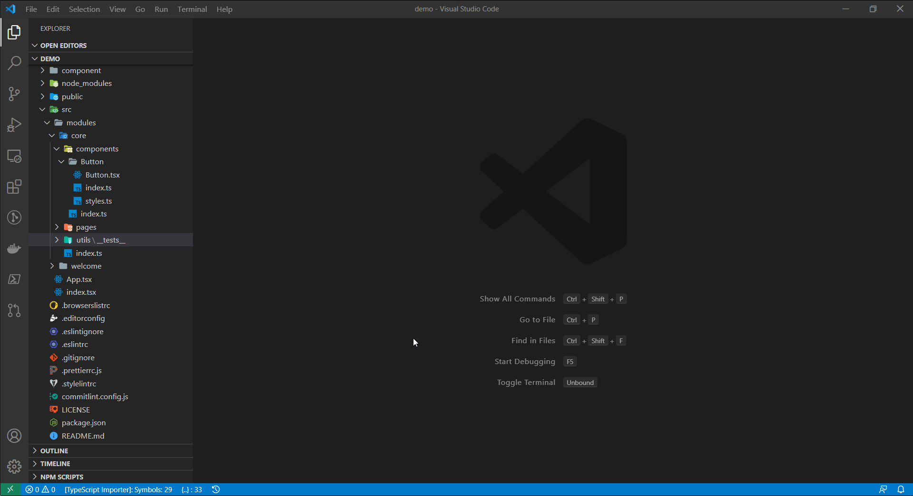

# Supercharge React

## Installation

Go to the link below and click `Install`.

[Visual Studio Code Marketplace](https://marketplace.visualstudio.com/items?itemName=borisyordanov.sup-react)

## Commands

### Davinci command execution

Running `Execute Davinci command` allows you to run commands available from the [Davinci packages](https://www.npmjs.com/package/@toptal/davinci#packages).

### Generators



Powered by [@toptal/davinci-code](https://www.npmjs.com/package/@toptal/davinci-code), which is part of [Davinci CLI](https://www.npmjs.com/package/@toptal/davinci-code).

| Command       | Output                                                  |
| ------------- | ------------------------------------------------------- |
| New Module    | `src/modules/<your-module>`                             |
| New Component | `src/modules/<your-module>/components/<your-component>` |
| New Page      | `src/modules/<your-module>/pages/<your-component>`      |

Using these commands will generate a folder structure in this format:

```js
├── src/
    ├── modules/
       ├── core/
       │   ├── index.ts
       │   └── components/
       │       └── Button/
       │           ├── Button.tsx
       │           ├── index.tsx
       │           └── style.ts
       └── jobs/
           ├── index.ts
           ├── components/
           │   ├── Jobs/
           │   │   ├── Jobs.tsx
           │   │   ├── index.ts
           │   │   ├── style.ts
           │   │   └── test.tsx
           │   └── Offers/
           │       ├── Offers.tsx
           │       ├── index.ts
           │       ├── style.ts
           │       └── test.tsx
           └── pages/
               ├── index.ts
               └── JobsSearch/
                   ├── JobsSearch.tsx
                   ├── index.ts
                   └── style.ts
```

## CI

- Version are automatically bumped. Read more [here](https://github.com/marketplace/actions/github-action-for-vsce)
- [Automatic publishing](https://github.com/marketplace/actions/github-action-for-vsce) when a PR is merged to master thanks
